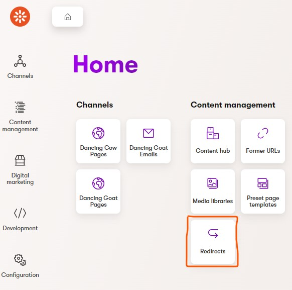
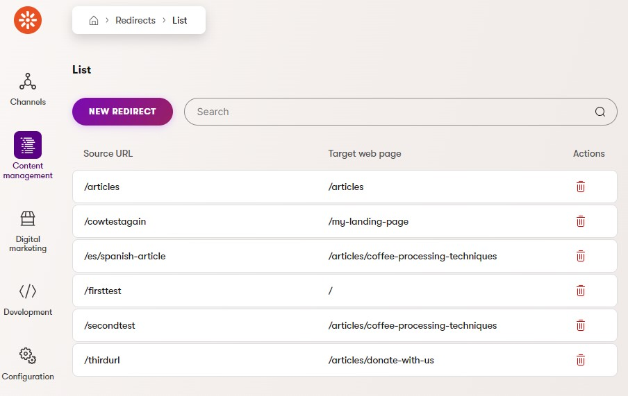
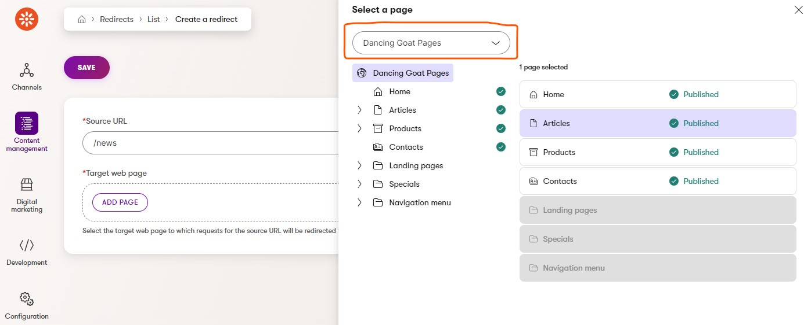

# Xperience Community: URL Redirects

## Description

Adds a module to the Xperience by Kentico administration interface to enable the management of URL redirects for web pages in website channels.

## Screenshots

Once installed, a new `Redirects` app appears on the in the `Content management` section of the navigation and dashboard (shown below) in the adminstration interface.

<a href="images/xperience-community-redirects-screenshot-dashboard.jpg">
  
</a>

Navigating to the app presents a list of redirects.

<a href="images/xperience-community-redirects-screenshot-listing.jpg">
  
</a>

Clicking `New redirect` will enable you to create a new redirect, entering the `source URL` and then selecting relevant `target web page` that users should be redirected to. Note that when more than one web channel is present, the page selector enables users to switch to the relevant web channel content tree via the drop-down, highlighted below.

<a href="images/xperience-community-redirects-screenshot-create.jpg">
  
</a>

## Redirect functionality

- The website checks each incoming request URL against a list of predefined redirects created via a custom module.
- If a match is found, a 301 redirect is issued, and the user is automatically redirected to the target webpage.
- Redirects are created on a per web channel basis, ensuring that you must select the relevant web channel when choosing the target page.
- The functionality will attempt to redirect the user to the correct language variant of the target page by analyzing the source URL for the presence of a culture code (e.g. `en-GB`) or a language name (e.g. `en`) URL prefix.
- Users will be redirected based on the target page's `canonical URL` setting, whether it is the `system URL` or the `vanity URL` defined for the page.
- Only relative URLs are supported for `source URLs` at this time. Absolute URLs are not supported.
- The redirects middleware is placed later in the request pipeline that the Kentico middleware, meaning that Kentico's URL
- The custom redirect middleware is placed after Kentico's own middleware in the request pipeline, ensuring that any Kentico-developed URL redirect functionality takes priority over any custom redirects.

## Library Version Matrix

| Xperience by Kentico version | Library version |
|------------------------------|-----------------|
| >= 29.5.0                    | 1.0.0           |

## Dependencies

- [ASP.NET Core 8.0](https://dotnet.microsoft.com/en-us/download)
- [Xperience by Kentico](https://docs.xperience.io/xp/changelog)

## Package Installation

Add the package to your application using the .NET CLI

```powershell
dotnet add package XperienceCommunity.Redirects
```

## Quick Start

1. Install NuGet package above.

2. Register the Redirects service using `builder.Services.AddXperienceCommunityRedirects()`:

   ```csharp
   // Program.cs

   var builder = WebApplication.CreateBuilder(args);

   builder.Services.AddKentico();

   // ...

   builder.Services.AddXperienceCommunityRedirects();
   ```


3. Register the Redirects middleware using `app.UseXperienceCommunityRedirects()`:

   ```csharp
    var app = builder.Build();

    app.UseKentico();

    // ...
    
    app.Kentico().MapRoutes();

    app.UseXperienceCommunityRedirects();
   ```

4. That's it, launch your website and the module will be installed ready to go! Once you've created your first redirect, give it a test in your browser. Happy redirecting!

## Contributing

Feel free to submit issues or pull requests to the repository, this is a community package and everyone is welcome to support.

## License

Distributed under the MIT License. See [`LICENSE.md`](LICENSE.md) for more information.